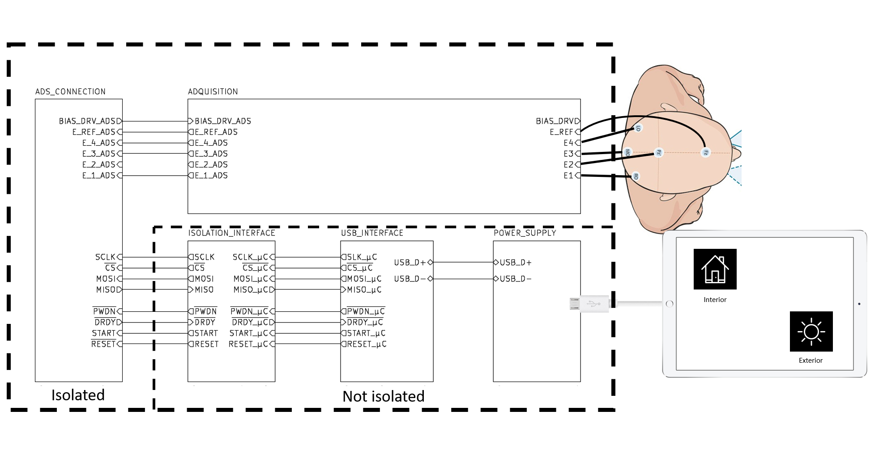

# Domótica con SSVEP

Trabajo práctico final realizado en el contexto de la Especialidad en Sistemas Embebidos de la FIUBA para el curso "Biopotenciales y signos vitales, registro y aplicaciones".

Autor: [Marcos Domínguez](https://github.com/mrds90)

3 de mayo de 2022

v1.0.0
## Contenido

- [Domótica con SSVEP](#domótica-con-ssvep)
  - [Contenido](#contenido)
  - [Introducción](#introducción)
    - [Propósito](#propósito)
    - [Alcances y limitaciones](#alcances-y-limitaciones)
    - [Referencias](#referencias)
  - [Descripción de la Aplicación](#descripción-de-la-aplicación)
  - [Diagrama en bloques del sistema](#diagrama-en-bloques-del-sistema)
  - [Implementación](#implementación)
  - [Conclusiones](#conclusiones)
## Introducción
### Propósito
Se presenta una propuesta de aplicación para personas con enfermedades degenerativas. Esta consiste en una solución para controlar dispositivos del hogar utilizando potenciales evocados visuales en estado estacionario (*SSVEP*).

### Alcances y limitaciones
Este trabajo se realiza en contexto universitario con fines educativos. El proyecto se limita a plantear la idea da aplicación y el esquemático del sistema. No se realiza el montaje completo del equipo o el desarrollo del firmware para que la aplicación sea funcional.

### Referencias

- **[RD1]** [DS52057A](Docs/RefDocuments/DS52057A%20-%20MCP2210EvaluationKit.pdf) - MCP2210 Evaluation Kit User's Guide
- **[RD2]** [DS20002288C](Docs/RefDocuments/DS20002288C%20-%20MCP2210-USB-to-SPI-Protocol-Converter-with-GPIO-(Host-Mode).pdf) - MCP2210 USB-to-SPI Protocol Converter with GPIO (Host Mode)
- **[RD3]** [SBAS499C](Docs/RefDocuments/SBAS499C%20-%20ads1299.pdf) - ADS1299-x Low-Noise, 4-, 6-, 8-Channel, 24-Bit, Analog-to-Digital Converter for EEG and Biopotential Measurements
- **[RD4]** [SLAU443B](Docs/RefDocuments/SLAU443B%20-%20ADS1299%20Performance%20Demonstration%20Kit.pdf) - ADS1299 Performance Demonstration Kit
- **[RD5]** [Schematics](https://github.com/EFilomena/PonchoDeBiopotenciales/blob/master/Hardware/doc/Schematics.pdf) - Poncho de biopotenciales

## Descripción de la Aplicación

Esta aplicación consiste en un dispositivo que adquiere EEG y se conecta via USB a una tablet. La tablet tiene la aplicación que interactúa con el usuario.
Esta aplicación posee pantallas con pocas opciones para que el usuario vaya avanzando hasta llegar al dispositivo que quiere controlar.
En las siguiente figura se muestra la pantalla inicial del sistema.

Al seleccionar una opción se vera un menú similar al siguiente (depende de la configuración del hogar para el usuario particular).

En el menu anterior los ambientes se muestran en función de los últimos seleccionados por el usuario. Es decir que siempre que entre a la opción "hogar" del primer menu, las primeras dos opciones que aparecerán son los dos últimos ambientes que se eligieron en la app.

Seleccionado el ambiente aparecen los dispositivos. A continuación se muestra como se visualizan los dispositivos de forma genérica:

## Diagrama en bloques del sistema

En la siguiente imagen se puede visualizar el diagrama en bloques del sistema:

## Implementación

Para implementar el sistema se seleccionó como AFE el ADS1299 porque es un dispositivo muy probado y permite escalabilidad del sistema en un futuro. Esto último se debe a que posee una cantidad de canales mayor a los previstos para el uso actual.
Se decidió utilizar una referencia común para los 4 canales planteados.

Para definir el conexionado de este dispositivo se baso el circuito principalmente en las referencias de [RD4](#referencias) y [RD5](#referencias).

Ademas se utiliza un filtro anti-alias a la entrada de cada canal como se muestra en el siguiente esquema:

Para obtener la aislación respecto a la alimentación, se utilizan dos ADuMs. En estos se transmiten las señales de SPI y de control entre el ADS1299 y el MCP2210. Este circuito está basado en el circuito de [RD5](#referencias).

El MCP2210 es un conversor de protocolo SPI (que permite la comunicación entre el ADS1299) a USB. Ademas posee una interfaz de GPIO que se utiliza para las señales de control. El circuito está basado en el circuito de [RD1](#referencias).

La alimentación de 5V se realiza mediante USB y se regula a 3.3V con el MCP1825S. El circuito está basado en el circuito de [RD1](#referencias).

En el siguiente enlace se puede encontrar el proyecto en KiCad para visualizarlo: [KiCad Project](https://github.com/mrds90/BIOP/tree/master/ProyectoBiopotenciales/BiopotencialesDomoticaEEG/DomoticaEEG/BiopDomoticaEEG).

Para su correcta visualización debe utilizar las siguiente librería: [KiCad-Librerías](https://github.com/mrds90/KiCad_Library).

También puede encontrar el esquemático completo en formato pdf en: [Schematic.pdf](Docs/Schematic.pdf).

## Conclusiones

Se implementó el diseño de un circuito para adquisición de biopotenciales. Se aprendió a utilizar la herramienta de diseño de Hardware KiCad para generar el esquemático del circuito. Adicionalmente se planteó una aplicación para el control de dispositivos del hogar utilizando potenciales evocados visuales en estado estacionario.

